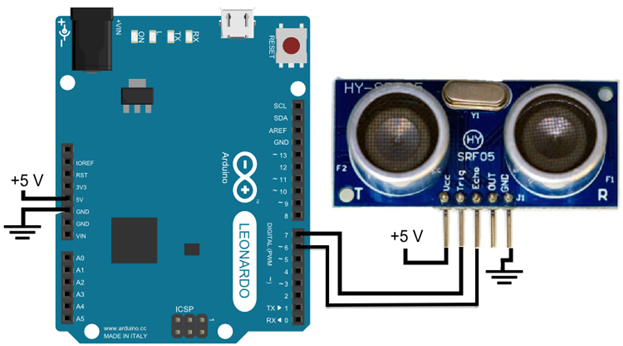
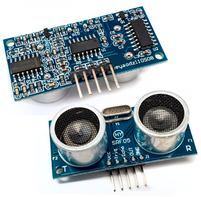

# Thực hành với cảm biến siêu âm HC-SR05
## Giới thiệu

### Cảm biến siêu âm HC-SR05




## Linh Kiện
### Cảm biến siêu âm HC-SR05
Cảm biến siêu âm HC-SR05 (cảm biến đo khoảng cách) sử dụng rất phổ biến để xác định khoảng cách. HC-SR05 sử dụng sóng siêu âm và có thể đo khoảng cách trong khoảng từ 2 -> 300 cm, với độ chính xác gần như chỉ phụ thuộc vào cách lập trình.

### Nguyên lý tính khoảng cách
Tốc độ của âm thanh trong không khí là 340 m/s (hằng số vật lý), tương đương với 29,412 microSeconds/cm (106 / (340*100)). Khi đã tính được thời gian, ta sẽ chia cho 29,412 để nhận được khoảng cách.

```c
unsigned long duration; // biến đo thời gian
int distance;           // biến lưu khoảng cách
/* Phát xung từ chân trig */
digitalWrite(trig,0);   // tắt chân trig
delayMicroseconds(2);
digitalWrite(trig,1);   // phát xung từ chân trig
delayMicroseconds(5);   // xung có độ dài 5 microSeconds

digitalWrite(trig,0);   // tắt chân trig

/* Tính toán thời gian */
// Đo độ rộng xung HIGH ở chân echo.
duration = pulseIn(echo,HIGH);

// Tính khoảng cách đến vật.
distance = int(duration/2/29.412);
```

* Các thông số chính
  - Nguồn làm việc: 3.3V – 5V (chuẩn 5V)
  - Dòng tiêu thụ : 2mA
  - Tín hiệu đầu ra xung: HIGH (5V) và LOW (0V)
  - Khoảng cách đo: 2cm – 300cm
  - Độ chính xác: 0.5cm

* Sơ đồ chân của HC-SR05 gồm 4 chân:
  - VCC –> pin 5V Arduino.
  - trig –> chân digital (OUTPUT), đây là chân sẽ phát tín hiệu từ cảm biến.
  - echo –> chân digital (INPUT), đây là chân sẽ nhận lại tín hiệu được phản xạ từ vật cản
  - GND —> GND Arduino.

## Lắp mạch
### Sơ đồ ráp mạch


### Mã chương trình
```C
// Maximum distance we want to ping for (in centimeters). Maximum sensor distance is rated at 400-500cm.
#define MAX_DISTANCE_FROM_OBSTACLE 20
const int TRIG_PIN = 7;     // chân trig của HC-SR04
const int ECHO_PIN = 6;     // chân echo của HC-SR04

// Biến lưu trữ khoảng cách
bool DEBUG_LOG = true;

int motorLeft[] = {12, 13};
int motorRight[] = {11, 10};

// Thiết lập
void setup() {
  // Mã thiết lập Arduino
  // Giao tiếp Serial với baudrate 9600
  Serial.begin(9600);
  // Cài đặt chân trig sẽ phát tín hiệu
  pinMode(TRIG_PIN, OUTPUT);
  // Cài đặt chân echo sẽ nhận tín hiệu
  pinMode(ECHO_PIN, INPUT);    

  for(int i = 0; i < 2; i++){
    pinMode(motorLeft[i], OUTPUT);
    pinMode(motorRight[i], OUTPUT);
  }
}

// Lặp và xử lý
void loop() {
  int distance = calculateDistance();
  if (distance < MAX_DISTANCE_FROM_OBSTACLE)
  {
    rotateRight(90);
  }
  else
  {
    driveForward();
  }
  delay(100);
}

void rotateRight(int angle)
{
  for(int i=0; i < angle; i++)
  {
    turnRight();
    // Nghỉ 25 ms sau đó tiếp tục rẽ phải
    delay(25);
  }
}

void driveForward() {
  digitalWrite(motorLeft[0], HIGH); 
  digitalWrite(motorLeft[1], LOW); 
  
  digitalWrite(motorRight[0], HIGH); 
  digitalWrite(motorRight[1], LOW); 
}

void driveBackward() {
  digitalWrite(motorLeft[0], LOW); 
  digitalWrite(motorLeft[1], HIGH); 
  
  digitalWrite(motorRight[0], LOW); 
  digitalWrite(motorRight[1], HIGH); 
}

void turnLeft() {
  digitalWrite(motorLeft[0], LOW); 
  digitalWrite(motorLeft[1], HIGH); 
  
  digitalWrite(motorRight[0], HIGH); 
  digitalWrite(motorRight[1], LOW);
}

void turnRight() {
  digitalWrite(motorLeft[0], HIGH); 
  digitalWrite(motorLeft[1], LOW); 
  
  digitalWrite(motorRight[0], LOW); 
  digitalWrite(motorRight[1], HIGH); 
}

void motorStop(){
  digitalWrite(motorLeft[0], LOW); 
  digitalWrite(motorLeft[1], LOW); 
  
  digitalWrite(motorRight[0], LOW); 
  digitalWrite(motorRight[1], LOW);
}

// Tính toán khoảng cách đến chướng ngại vật với sensor HC-SR04
int calculateDistance() {
  int distance = 0;
  // biến đo thời gian
  unsigned long duration;
  // Phát xung từ chân trig
  // {ắt chân TRIGGER
  digitalWrite(TRIG_PIN,0);
  delayMicroseconds(2);
  // phát xung từ chân trig
  digitalWrite(TRIG_PIN,1);
  // Dừng 5 microSeconds
  delayMicroseconds(5);

  // Tắt chân trig
  digitalWrite(TRIG_PIN,0);

  /* Tính toán thời gian */
  // Đo độ rộng xung HIGH ở chân echo.
  duration = pulseIn(ECHO_PIN,HIGH);

  // Tính khoảng cách đến vật bằng cách chia cho [2 * 29.412]
  distance = int(duration/2/29.412);
  /* In kết quả ra Serial Monitor */
  if (DEBUG_LOG)
  {
    Serial.print(distance);
    Serial.println(" (cm)");
  }

  return distance;
}
```