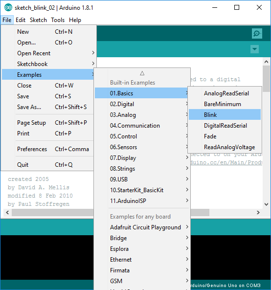
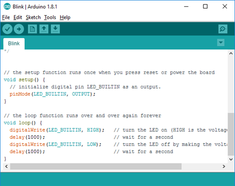

# Chương trình Blink
## Tìm đoạn chương trình mẫu "Blink" từ trình Arduino IDE
Em có thể tìm thấy đoạn chương trỉnh mẫu "Blink" từ trình Arduino IDE

## Nội dung chương trình Blink
```C
// // Phương thức setup() được chạy một lần khi em nhấn Reset or Tắt mở nguồn trên board.
void setup() {
  // Cài đặt đèn led trên board mạch là ngõ ra
  pinMode(LED_BUILTIN, OUTPUT);
}

// Phương thức loop() sẽ được gọi liên tục
void loop() {
  // Bật đèn led trên board mạch sáng, HIGH: bật đèn
  digitalWrite(LED_BUILTIN, HIGH
  // Chờ trong 1 giây, 1 giây là 1000 milli giây
  delay(1000);
  // Tắt đèn led trên board mạch, LOW: tắt đèn
  digitalWrite(LED_BUILTIN, LOW);
  // Chờ trong 1 giây
  delay(1000);
}
```

## Biên dịch và tải ứng dụng lên board mạch


 Nhấn nút này để biên dịch và kiểm tra chương trình soạn thảo, sửa các lỗi và lặp lại quá trình biên dịch.

 Nhấn nút này để tải ứng dụng lên board mạch.


