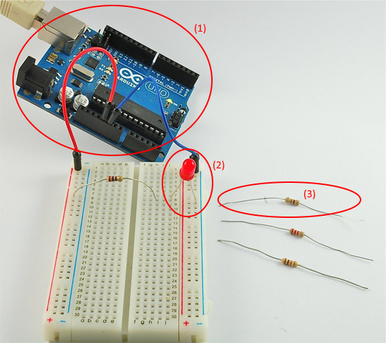
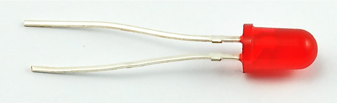
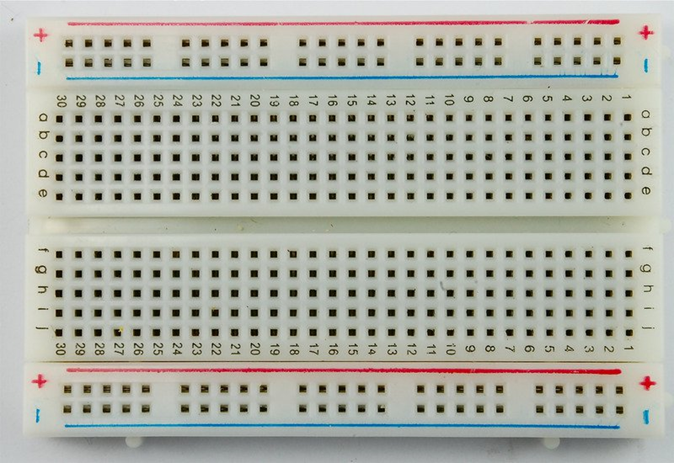
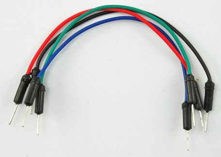

# Thắp sáng đèn LED trên bảng mạch
## Giới thiệu linh kiện


(1): Board mạch Arduino

(2): đèn LED

(3): điện trở


(4) Bảng mạch


(5): dây nối


## Lắp ráp linh kiện


## Chương trình
```C
/*
  Chương trình chớp tắt
  Bật và tắt đèn LED trong vòng 1 giây, sau đó tắt nó và liên tục như thế.
 */

// Chân 13 kết nối với đèn LED trên bảng mạch Arduino.
// Khai báo chân 13
int led = 13;

// Phương thức setup() được chạy một lần khi em nhấn reset:
void setup() {                
  // Khai báo chân LED là ngõ xuất
  pinMode(led, OUTPUT);     
}

// Vòng lặp sẽ chạy liên tục mãi mãi:
void loop() {
  // Bật đèn LED (HIGH cho trạng thái bật)
  digitalWrite(led, HIGH);
  // Chờ trong 1000 milli giây (1 giây)
  delay(1000);
  // Tắt đèn LED (LOW cho trạng thái tắt)
  digitalWrite(led, LOW);
  delay(1000);
}

```