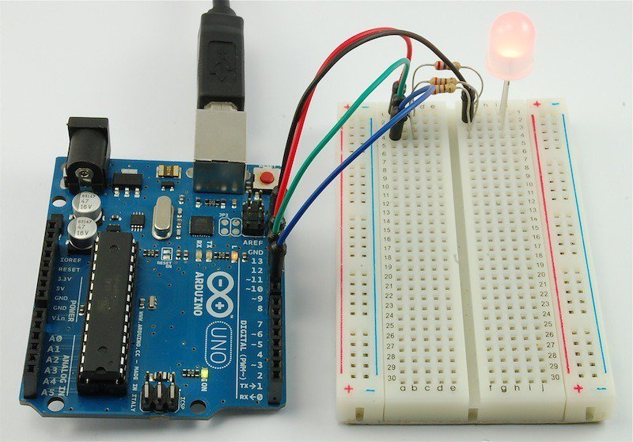
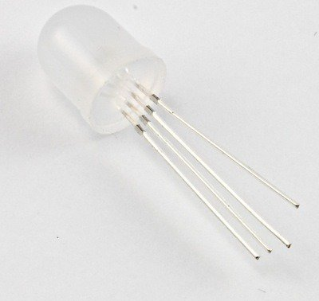
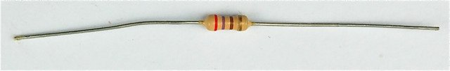
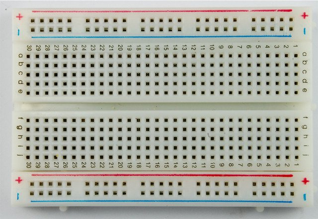
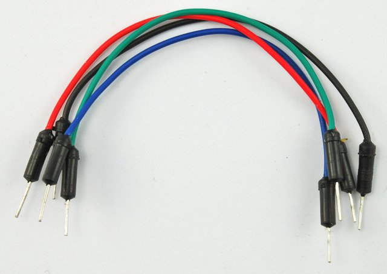
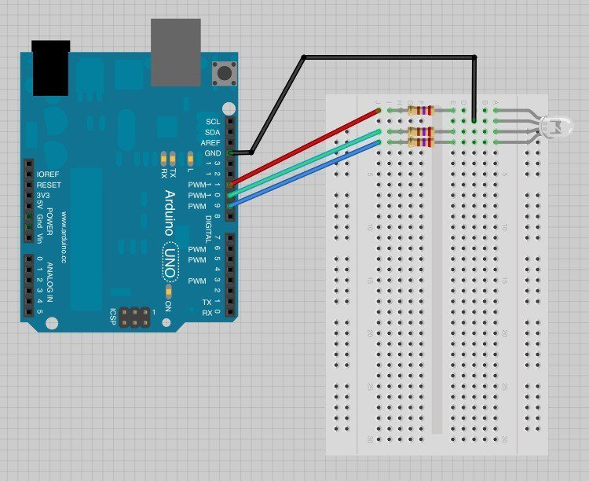
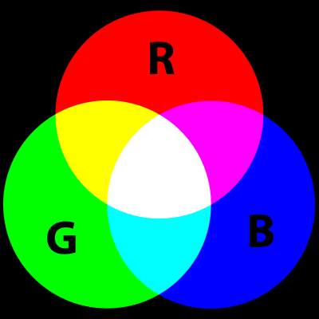
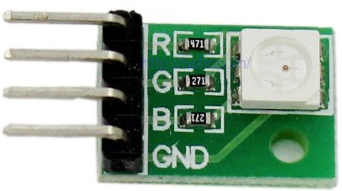
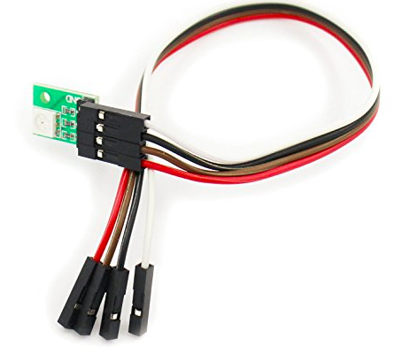
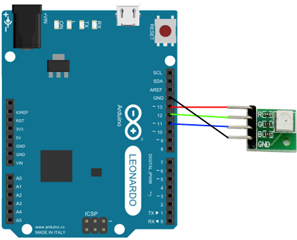

# Thực hành Đổi Màu Đèn LED
## Giới thiệu
Trong bài học sau đây, em sẽ làm quen với việc điều khiển đổi màu đèn LED. Em sẽ học cách sử dụng hàm ```analogWrite()``` để điều khiển màu sắc của đèn LED.


Điều đầu tiên cần phải biết là đèn LED đổi màu tương tự như 1 đèn LED bình thường và nó đơn giản có ba bóng với ba màu ĐỎ (RED), XANH LÁ (GREEN) và XANH DƯƠNG (Blue). Bằng việc điều khiển độ sáng từng bóng, các em có thể phối trộn cho ra bất cứ màu gì mình thích.
Để làm được điều đó, em cần học cách điều khiển độ sáng tối của đèn bằng các điện trở khác nhau.

## Linh Kiện
Đèn LED ba màu


Điện trở 270 Ohm


Bảng mạch


Dây cắm


## Thiết Kế Mạch


## Màu Sắc
Em có thể pha trộn các màu cơ bản RGB để tạo ra các màu sắc theo ý muốn. Hình sau mô tả nguyên lý phối màu.


* Nếu em pha trộn các màu với cùng độ sáng, màu thu được sẽ là màu trắng.
* Nếu em tắt đèn màu xanh dương, bật đèn đỏ và xanh lá cùng độ sáng, màu thu được là màu vàng.

## Chương Trình
```C
// Khai báo chân 11 cho màu đỏ, chân 10 cho màu xanh lá, chân 9 cho màu xanh dương
int redPin = 11;
int greenPin = 10;
int bluePin = 9;
 
void setup()
{
  pinMode(redPin, OUTPUT);
  pinMode(greenPin, OUTPUT);
  pinMode(bluePin, OUTPUT);  
}
 
void loop()
{
  setColor(255, 0, 0);  // red
  delay(1000);
  setColor(0, 255, 0);  // green
  delay(1000);
  setColor(0, 0, 255);  // blue
  delay(1000);
  setColor(255, 255, 0);  // yellow
  delay(1000);  
  setColor(80, 0, 80);  // purple
  delay(1000);
  setColor(0, 255, 255);  // aqua
  delay(1000);
}

void setColor(int red, int green, int blue)
{
  analogWrite(redPin, red);
  analogWrite(greenPin, green);
  analogWrite(bluePin, blue);  
}
```

## Mạch hiển thị LED RGB
### Giới thiệu
Hình sau mô tả mạch hiển thị LED RGB, đã gắn sẵn các điện trở. Em chỉ cần cắm dây cho đúng các chân.



Mạch đi kèm 1 bộ dây chuẩn giúp em dễ thao tác với mạch Arduino.



### Ráp mạch
Hình sau mô tả cách thức ráp mạch Arduino với mạch hiển thị LED RGB.



* Ghi chú:
  - Chân 13: nối với đèn RED
  - Chân 12: nối với đèn GREEN
  - Chân 11: nối với đèn BLUE

### Lập trình
Như sơ đồ ráp mạch ở trên, em có thể định nghĩa các chân như sau:
```C
// Khai báo chân 13 cho màu đỏ, chân 12 cho màu xanh lá, chân 10 cho màu xanh dương
const int RED_PIN = 13;
const int GREEN_PIN = 12;
const int BLUE_PIN = 11;

// Khai báo thời gian nghỉ giữa các lần xử lý
const int DELAY_TIME = 500;

// Biến đếm count sẽ dùng cho việc thay đổi màu đèn, ví dụ 0 cho màu đỏ, 1 cho màu xanh lá và 2 cho màu xanh dương
int count = 0;
```

Với việc khai báo như trên, trong phương thức ```setup()```, em cần khai báo như sau:
```C
void setup() {
  pinMode(RED_PIN, OUTPUT);
  pinMode(GREEN_PIN, OUTPUT);
  pinMode(BLUE_PIN, OUTPUT);  
}
```

Trong phương thức ```loop()''', em có thể tham khảo đoạn chương trình mẫu thay đổi màu đèn:

```C
void loop() {
  // Khi biến đếm vượt quá 3, biến sẽ được cập nhật lại về 0, 
  // nhằm bắt đầu 1 chu trình đổi màu mới
  if (count >= 3) {
    count = 0;
  }

  if (count == 0) {
    // Hiển thị đèn LED RGB với màu đỏ
    setColor(255, 0, 0);
  } else if (count == 1) {
    // Hiển thị đèn LED RGB với màu xanh lá
    setColor(0, 255, 0);
  } else if (count == 2) {
    // Hiển thị đèn LED RGB với màu xanh dương
    setColor(0, 0, 255);
  }

  // Tăng biến đếm thêm 1 cho lần lặp tiếp theo
  count++;

  delay(DELAY_TIME);
}
```

Chi tiết phương thức ```setColor()```
```C
// Phương thức thiết lập màu sắc bằng cách ghi giá trị màu tương ứng với các chân đã định nghĩa trước
void setColor(int red, int green, int blue)
{
  analogWrite(RED_PIN, red);
  analogWrite(GREEN_PIN, green);
  analogWrite(BLUE_PIN, blue);  
}
```

Phần sau là toàn bộ nội dung chương trình
```C

// Khai báo chân 13 cho màu đỏ, chân 12 cho màu xanh lá, chân 10 cho màu xanh dương
const int RED_PIN = 13;
const int GREEN_PIN = 12;
const int BLUE_PIN = 11;

// Khai báo thời gian nghỉ giữa các lần xử lý
const int DELAY_TIME = 500;

// Biến đếm count sẽ dùng cho việc thay đổi màu đèn, ví dụ 0 cho màu đỏ, 1 cho màu xanh lá và 2 cho màu xanh dương
int count = 0;

void setup() {
  pinMode(RED_PIN, OUTPUT);
  pinMode(GREEN_PIN, OUTPUT);
  pinMode(BLUE_PIN, OUTPUT);  
}

void loop() {
  // Khi biến đếm vượt quá 3, biến sẽ được cập nhật lại về 0, 
  // nhằm bắt đầu 1 chu trình đổi màu mới
  if (count >= 3) {
    count = 0;
  }

  if (count == 0) {
    // Hiển thị đèn LED RGB với màu đỏ
    setColor(255, 0, 0);
  } else if (count == 1) {
    // Hiển thị đèn LED RGB với màu xanh lá
    setColor(0, 255, 0);
  } else if (count == 2) {
    // Hiển thị đèn LED RGB với màu xanh dương
    setColor(0, 0, 255);
  }

  // Tăng biến đếm thêm 1 cho lần lặp tiếp theo
  count++;

  delay(DELAY_TIME);
}

// Phương thức thiết lập màu sắc bằng cách ghi giá trị màu tương ứng với các chân đã định nghĩa trước
void setColor(int red, int green, int blue)
{
  analogWrite(RED_PIN, red);
  analogWrite(GREEN_PIN, green);
  analogWrite(BLUE_PIN, blue);  
}
```

### Các thực hành khác
* Em hãy thay đổi chương trình để đèn chớp tắt nhanh hơn.
* Em hãy thay đổi chương trình để đèn chớp tắt 2 giây một lần.
* Em hãy thay đổi chương trình để đèn hiển thị các màu sau:
Em có thể tham khảo hình sau để thiết lập màu:

  - Màu tím (255, 0, 255)
  - Màu vàng (255-255-0)

* Em hãy thay đổi chương trình để có thể hiển thị nhiều màu sắc hơn
(Gợi ý: thay đổi điều kiện thiết lập lại biến ```count``` về 0, mở rộng các khối ```else if``` để hiện thị các màu sắc khác)

* Em thay đổi các chân cắm (đỏ: 11, xanh lá 12, xanh dương 13) và cập nhật lại chương trình và tải lên mạch Arduino và làm lại các thực hành trên nhé.