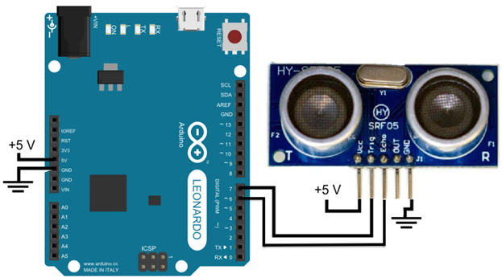
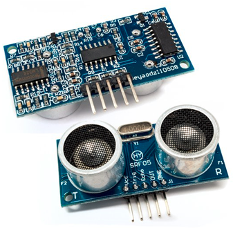
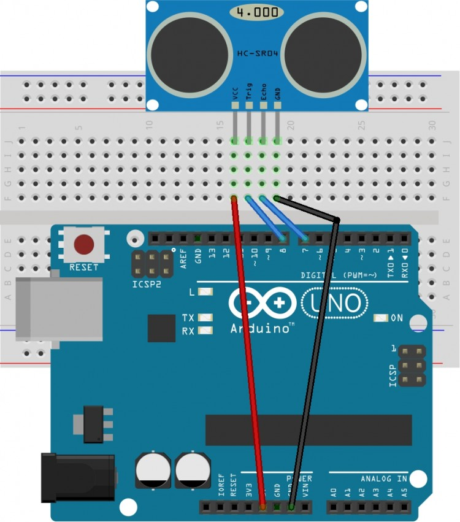

# Thực hành với cảm biến siêu âm HC-SR05
## Giới thiệu

### Cảm biến siêu âm HC-SR05

### Sơ đồ ráp mạch

## Linh Kiện
### Cảm biến siêu âm HC-SR05
Cảm biến siêu âm HC-SR05 (cảm biến đo khoảng cách) sử dụng rất phổ biến để xác định khoảng cách. HC-SR05 sử dụng sóng siêu âm và có thể đo khoảng cách trong khoảng từ 2 -> 300 cm, với độ chính xác gần như chỉ phụ thuộc vào cách lập trình.

* Các thông số chính

- Nguồn làm việc: 3.3V – 5V (chuẩn 5V)
- Dòng tiêu thụ : 2mA
- Tín hiệu đầu ra xung: HIGH (5V) và LOW (0V)
- Khoảng cách đo: 2cm – 300cm
- Độ chính xác: 0.5cm
* Sơ đồ chân của HC-SR05 gồm 4 chân:
- VCC –> pin 5V Arduino.
- trig –> chân digital (OUTPUT), đây là chân sẽ phát tín hiệu từ cảm biến.
- echo –> chân digital (INPUT), đây là chân sẽ nhận lại tín hiệu được phản xạ từ vật cản
- GND —> GND Arduino.