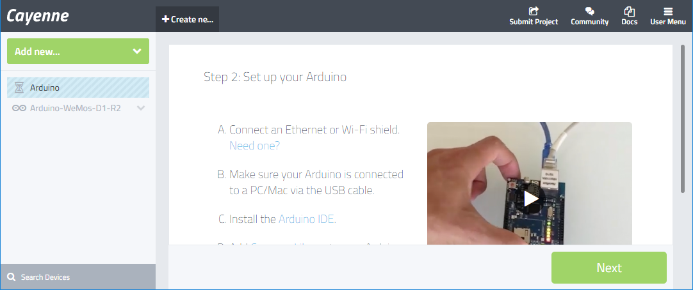
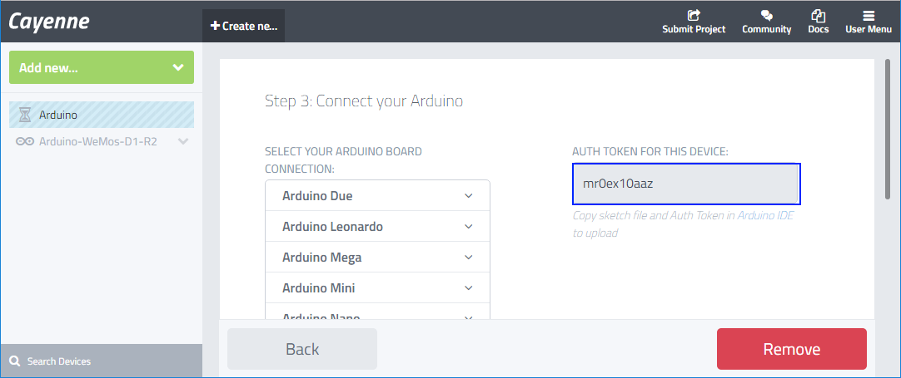
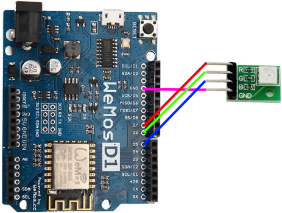

# Thực hành bật tắt đèn LED với Cayenne và mạch WeMos D1 R2 (8266)
## Giới thiệu

### Cayenne
Cayenne là dự án Internet of Thing (IOT), hỗ trợ quản lý các thiết bị, giám sát cũng như công tác điều khiển cho các thiết bị này.


Với Cayenne, các em có thể xây dựng các màn hình giám sát thiết bị hoặc điều khiển thiết bị từ xa thông qua Cayenne.

### WeMos D1 R2
WEMOS D1 R2 là kit phát triển phiên bản mới nhất từ WeMos, kit được thiết kế với hình dáng tương tự Arduino Uno nhưng trung tâm lại là module wifi Soc ESP8266EX được build lại firmware để có thể chạy với chương trình Arduino.  Kit thích hợp và dễ dàng thực hiện các ứng dụng thu thập dữ liệu và điều khiển qua Wifi.


KIT ESP8266 WeMos D1 R2 có hình dáng giống Arduino Uno, sử dụng chip wifi ESP8266-12, có thể được nạp Firmware để viết chương trình như Arduino

* Có 11 chân vào/ra số
* 1 chân Analog (chỉ đọc được điện áp 1V)
* Kết nối USB bằng cổng MicroUSB
* Điện áp hoạt động: 5V (từ cổng USB) hoặc 7-12V (từ cổng DC)
* Tương thích Arduino IDE và NodeMCU

[Tài liệu tham khảo](https://www.wemos.cc/tutorial)

### Cấu hình Arduino IDE để làm việc với Cayenne và WeMos
* Thiết lập Arduino IDE với WeMos
Trên menu ứng dụng Arduino IDE, chọn: ```Tools > Boards : "[Board type]" > Boards Manager...```


Em nhập 8266 vào ô nhập ```Type```, sau đó chọn ```Install```. Hình minh họa trên là sau khi em đã cài đặt thành công nhé.

* Thiết lập Arduino IDE với Cayenne

Một cách tương tự. em sẽ cài dặt các ví dụ về Cayenne cũng như các thư viện liên quan.
Trên menu ứng dụng của Arduino IDE, em chọn ```Sketch > Include Library > Manage Libraries...```. Sau đó nhập ```Cayenne``` vào ô nhập ```Topic``` như hình dưới đây:


Hình trên là hiển thị của Arduino IDE sau khi cài đặt hoàn thành.

## Thiết kế và lập trình mạch bật tắt đèn LED
Tương tự Arduino, WeMos dễ dàng để lập trình và thiết kế mạch. Mạch sau dùng để bật tắt đèn LED theo chân D7.

### Đăng ký tài khoản Cayenne

### Tạo mới một thiết bị trên Cayenne

Hai bước sau dùng để đăng ký thiết bị mới với Cayenne:
* Tạo mới thiết bị:



* Ghi nhớ mã an ninh dùng để kết nối với Cayenne



### Bật tắt đèn LED từ Cayenne
#### Ráp mạch
Hình sau mô tả mạch ráp để bật đèn LED. Pin D7 sẽ được dùng để kích nguồn cho đèn.


#### Mã chương trình
* Khai báo các thư viện liên quan

Các thư viện Cayenne và 8266 được khai báo để sử dụng trong ứng dụng:

```C
#define CAYENNE_DEBUG
#define CAYENNE_PRINT Serial

#include "CayenneDefines.h"
#include "BlynkSimpleEsp8266.h"
#include "CayenneWiFiClient.h"
#include "ESP8266WiFi.h"
```

* Khai báo các biến được sử dụng trong chương trình
```C
// Thông tin bảo mật dùng để kết nối với đám mây của Cayenne
char token[] = "abcdedghij";
// Thông tin WIFI kết nối
char ssid[] = "SSID";
char password[] = "Password";

unsigned long lastTempUpdate = 0;

// Khai báo PIN ảo trên Cayenne
#define VIRTUAL_PIN V4
```

* Phần chương trình cấu hình
```C
void setup()
{
  // Khai báo PIN 2 là chân xuất.
  pinMode(2, OUTPUT);

  // Khai báo chân D7 là chân xuất, ta sẽ dùng chân D7 để bật tắt đèn LED.
  pinMode(D7, OUTPUT);

  Serial.begin(9600);
  // Kết nối với Cayenne thông qua thông tin cấu hình WIFI
  Cayenne.begin(token, ssid, password);
}
```

* Phần chương trình thực thi
```C
void loop()
{
  Cayenne.run();
}

// Phương thức này sẽ được gọi khi đối tượng giao diện ghi giá trị cho chân ảo V2.
CAYENNE_IN(V2)
{
  CAYENNE_LOG("Got a value: %s", getValue.asStr());
  int i = getValue.asInt();
  
  if (i == 0)
  {
    digitalWrite(2, HIGH);
  }
  else
  {
    digitalWrite(2, LOW);
  }  
}

// Phương thức này sẽ được gọi khi đối tượng giao diện ghi giá trị cho chân ảo V7.
CAYENNE_IN(V7)
{
  CAYENNE_LOG("Got a value: %s", getValue.asStr());
  // Truy xuất dữ liệu từ Cayenne
  int i = getValue.asInt();
  if (i == 0)
  {
    // Nếu dữ liệu từ Cayenne là 0, ghi mức HIGH ra chân xuất D7
    digitalWrite(D7, HIGH);
  }
  else
  {
    // Nếu dữ liệu từ Cayenne là 1, ghi mức LOW ra chân xuất D7
    digitalWrite(D7, LOW);
  }  
}
```

### Bật tắt đèn LED RGB từ Cayenne
#### Ráp mạch
Hình sau mô tả mạch ráp để bật đèn LED. Pin D7, D6, D5 sẽ được dùng để kích nguồn cho đèn.



#### Mã chương trình
* Khai báo các thư viện liên quan

Các thư viện Cayenne và 8266 được khai báo để sử dụng trong ứng dụng:

```C
#define CAYENNE_DEBUG
#define CAYENNE_PRINT Serial

#include "CayenneDefines.h"
#include "BlynkSimpleEsp8266.h"
#include "CayenneWiFiClient.h"
#include "ESP8266WiFi.h"
```

* Khai báo các biến được sử dụng trong chương trình
```C
// Thông tin bảo mật dùng để kết nối với dịch vụ đám mây của Cayenne
char token[] = "mr0ex10aaz";
// Thông tin WIFI kết nối
char ssid[] = "MyFamily";
char password[] = "vgy78uhb";

#define PIN_RED D7
#define PIN_GREEN D6
#define PIN_BLUE D5

// Khai báo các biến dùng để lưu trữ độ sáng của các đèn (0 --> 255)
int redValue = 0;
int greenValue = 0;
int blueValue = 0;

```

* Phần chương trình cấu hình
```C
void setup()
{
  // Khai báo PIN 2 là chân xuất.
  pinMode(2, OUTPUT);

  // Khai báo chân các chân D7, D6, D5 là chân xuất, ta sẽ dùng các chân này để bật tắt đèn LED RGB.
  pinMode(PIN_RED, OUTPUT);
  pinMode(PIN_GREEN, OUTPUT);
  pinMode(PIN_BLUE, OUTPUT);

  Serial.begin(9600);
  // Kết nối với Cayenne thông qua thông tin cấu hình WIFI
  Cayenne.begin(token, ssid, password);
}
```

* Phần chương trình thực thi
```C
void loop()
{
  Cayenne.run();
}

// Phương thức này sẽ được gọi khi đối tượng giao diện ghi giá trị cho chân ảo V2.
CAYENNE_IN(V2)
{
  CAYENNE_LOG("Got a value: %s", getValue.asStr());
  int i = getValue.asInt();
  
  if (i == 0)
  {
    digitalWrite(2, HIGH);
  }
  else
  {
    digitalWrite(2, LOW);
  }  
}

// Phương thức này sẽ được gọi khi đối tượng giao diện ghi giá trị cho chân ảo V7.
CAYENNE_IN(V7)
{
  CAYENNE_LOG("Nha^.n duoc du*~ lie^.u tu*` Cayenne V7=%s", getValue.asStr());
  // Truy xuất dữ liệu từ Cayenne
  redValue = getValue.asInt();
  setColor(redValue, greenValue, blueValue);
}

// Phương thức này sẽ được gọi khi đối tượng giao diện ghi giá trị cho chân ảo V6.
CAYENNE_IN(V6)
{
  CAYENNE_LOG("Nha^.n duoc du*~ lie^.u tu*` Cayenne V6=%s", getValue.asStr());
  // Truy xuất dữ liệu từ Cayenne
  greenValue = getValue.asInt();
  setColor(redValue, greenValue, blueValue);
}

// Phương thức này sẽ được gọi khi đối tượng giao diện ghi giá trị cho chân ảo V5.
CAYENNE_IN(V5)
{
  CAYENNE_LOG("Nha^.n duoc du*~ lie^.u tu*` Cayenne V5=%s", getValue.asStr());
  // Truy xuất dữ liệu từ Cayenne
  blueValue = getValue.asInt();
  setColor(redValue, greenValue, blueValue);
}

void setColor(int red, int green, int blue)
{
  analogWrite(PIN_RED, red);
  analogWrite(PIN_GREEN, green);
  analogWrite(PIN_BLUE, blue);  
}
```