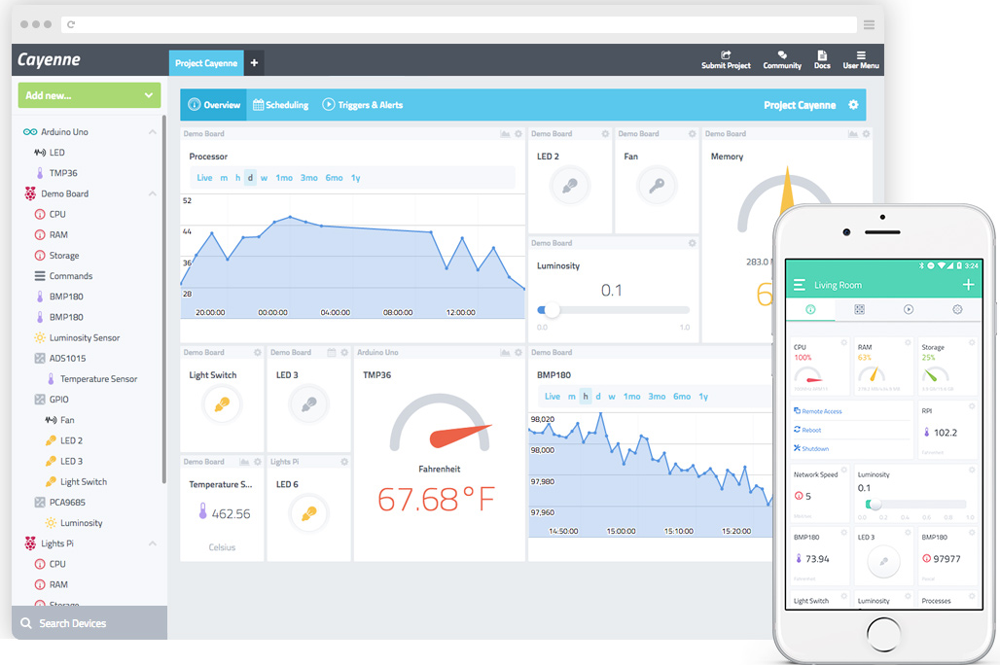
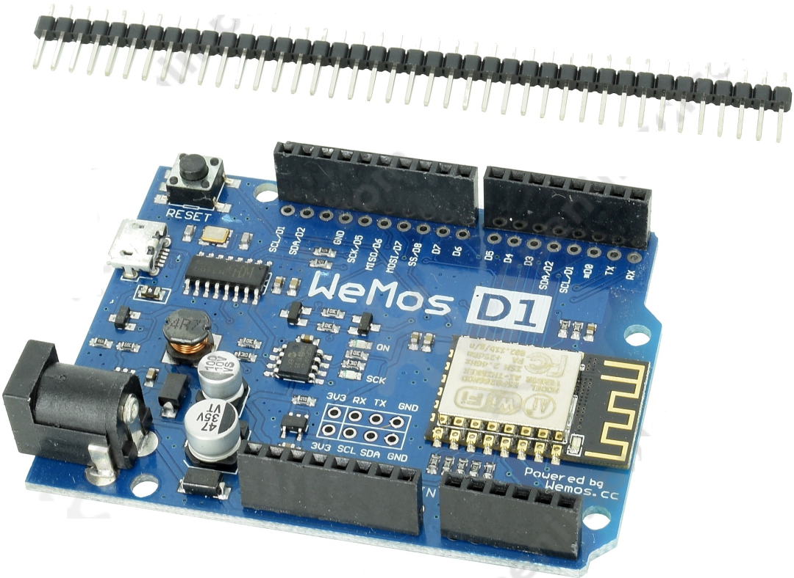
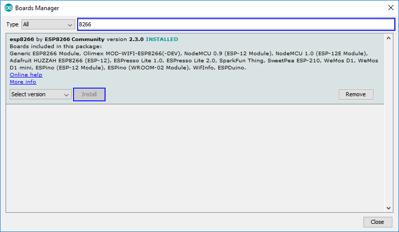
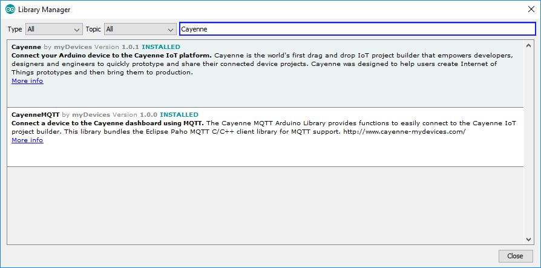
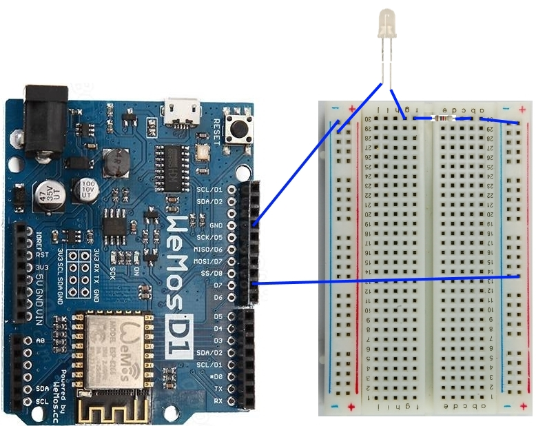

# Thực hành bật tắt đèn LED với Cayenne và mạch WeMos D1 R2 (8266)
## Giới thiệu

### Cayenne
Cayenne là dự án Internet of Thing (IOT), hỗ trợ quản lý các thiết bị, giám sát cũng như công tác điều khiển cho các thiết bị này.


Với Cayenne, các em có thể xây dựng các màn hình giám sát thiết bị hoặc điều khiển thiết bị từ xa thông qua Cayenne.

### WeMos D1 R2
WEMOS D1 R2 là kit phát triển phiên bản mới nhất từ WeMos, kit được thiết kế với hình dáng tương tự Arduino Uno nhưng trung tâm lại là module wifi Soc ESP8266EX được build lại firmware để có thể chạy với chương trình Arduino.  Kit thích hợp và dễ dàng thực hiện các ứng dụng thu thập dữ liệu và điều khiển qua Wifi.



KIT ESP8266 WeMos D1 R2 có hình dáng giống Arduino Uno, sử dụng chip wifi ESP8266-12, có thể được nạp Firmware để viết chương trình như Arduino

* Có 11 chân vào/ra số
* 1 chân Analog (chỉ đọc được điện áp 1V)
* Kết nối USB bằng cổng MicroUSB
* Điện áp hoạt động: 5V (từ cổng USB) hoặc 7-12V (từ cổng DC)
* Tương thích Arduino IDE và NodeMCU

[Tài liệu tham khảo](https://www.wemos.cc/tutorial)

### Cấu hình Arduino IDE để làm việc với Cayenne và WeMos
* Thiết lập Arduino IDE với WeMos
Trên menu ứng dụng Arduino IDE, chọn: ```Tools > Boards : "[Board type]" > Boards Manager...```



Em nhập 8266 vào ô nhập ```Type```, sau đó chọn ```Install```. Hình minh họa trên là sau khi em đã cài đặt thành công nhé.

* Thiết lập Arduino IDE với Cayenne

Một cách tương tự. em sẽ cài dặt các ví dụ về Cayenne cũng như các thư viện liên quan.
Trên menu ứng dụng của Arduino IDE, em chọn ```Sketch > Include Library > Manage Libraries...```. Sau đó nhập ```Cayenne``` vào ô nhập ```Topic``` như hình dưới đây:



Hình trên là hiển thị của Arduino IDE sau khi cài đặt hoàn thành.

## Thiết kế mạch bật tắt đèn LED
Tương tự Arduino, WeMos dễ dàng để lập trình và thiết kế mạch. Mạch sau dùng để bật tắt đèn LED theo chân D7.

### Ráp mạch:
Hình sau mô tả mạch ráp để bật đèn LED. Pin D7 sẽ được dùng để kích nguồn cho đèn.
